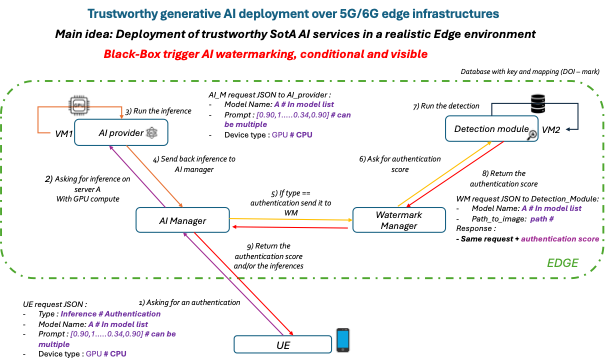

# SimpleRAN — AI Provider & Detection Module

<p align="center">
  
</p>

This project aims to prepare the deployment of a **trustworthy AI pipeline at the edge (5G/6G edge infrastructure)**.  
To support this goal, the repository provides two “complex” building blocks exposed as **FastAPI services**: an **AI generation provider** and a **detection/scoring module**, both designed to be modular and dynamically selectable via `model_name`.

This repository contains two independent FastAPI services:

- **`ai_provider/`**: image generation (adapted StyleGAN2-ADA) through `generate_<X>` modules.
- **`detection_module/`**: detection/scoring through `detection_<X>` modules.

Both APIs follow the same principle: **the `model_name` field in the prompt dynamically routes to the corresponding module**.

---

## 1) AI Provider (`ai_provider/`)

### Goal
Expose a `/generate` generation API that dynamically calls the right generation module based on `model_name` (e.g., `A` → `generate_A`, `B` → `generate_B`).

### API behavior
- Endpoint: `POST /generate`
- Input: JSON (`prompt`) containing at least:
  - `model_name` (e.g., `"A"`, `"B"`)
  - `prompt` (e.g., `[num_images, "seed"]`)
  - `device_type` (e.g., `"cpu"`)

The server:
1. Reads the JSON body (or loads `ai_provider/input/prompt.json` if no body is provided).
2. Extracts `model_name`.
3. Dynamically imports the matching module:
   - `model_name="B"` → imports `generate_B.generate_B`
4. Calls **`run_from_prompt_data(prompt_dict)`** in that module (optimized path).

### Latency optimizations
- **No-disk input**: the API calls `run_from_prompt_data(...)` and **does not write any temporary JSON** to disk.
- JSON-safe output: the API converts `Path` objects to `str` via `_jsonify_paths(...)` to ensure the response is JSON-serializable.
- Model cache (inside modules): `_CACHED_*` + a lock are used to avoid reloading the network on every request (when implemented in `generate_<X>`).

> Note: generation typically writes images to `outputs/`. This is an intentional disk write (output artifacts), separate from the “no-disk input” optimization. This step can be changed in the future if needed.

### Run the API
From the repository root:

```bash
cd ai_provider
python -m pip install -r requirements.txt
uvicorn fastapi_app:app --host 0.0.0.0 --port 8000 --workers 1
```

### Example request
Make sure you use the prompt from `ai_provider`:

```bash
curl -X POST http://localhost:8000/generate \
  -H "Content-Type: application/json" \
  -d @/Users/zough/Documents/Code/SimpleRAN/ai_provider/input/prompt.json
```

Example `ai_provider/input/prompt.json`:
```json
{
  "prompt": [1, "88"],
  "device_type": "cpu",
  "model_name": "B"
}
```

### Folder structure (summary)
```
ai_provider/
  fastapi_app.py
  input/
    prompt.json
  outputs/
  vanilla_weights/
  generate_A/
  generate_B/
```

---

## 2) Detection Module (`detection_module/`)

### Goal
Expose a `/detect` API that returns a detection score and **persists** an enriched JSON file into `detection_module/output/`.

### API behavior
- Endpoint: `POST /detect`
- Input: JSON containing at least:
  - `model_name` (e.g., `"A"`)
  - `image` (path to the image to analyze)
  - (optional) `device_type`

The server:
1. Reads the JSON body (or loads `detection_module/input/prompt.json` if no body is provided).
2. Extracts `model_name`.
3. Dynamically imports the matching module:
   - `model_name="A"` → imports `detection_A`
4. Calls **`run_from_prompt_data(prompt_dict)`** (no-disk input path).
5. Adds `detection_score` to the prompt, saves it into `detection_module/output/`, and returns:
   - `detection_score`
   - `output_json` (path to the saved JSON file)

### Latency optimizations
- **No-disk input**: FastAPI calls `run_from_prompt_data(...)`, so no temporary JSON is used for invocation.
- Output persistence: only the enriched JSON is written to `output/` (expected artifact).

### Run the API
From the repository root:

```bash
cd detection_module
python -m pip install -r requirements.txt
uvicorn fastapi_app:app --host 0.0.0.0 --port 8001 --workers 1
```

### Example request
```bash
curl -X POST http://localhost:8001/detect \
  -H "Content-Type: application/json" \
  -d @/Users/zough/Documents/Code/SimpleRAN/detection_module/input/prompt.json
```

Example `detection_module/input/prompt.json`:
```json
{
  "image": "/Users/zough/Documents/Code/SimpleRAN/ai_provider/outputs/seed0088_img00.png",
  "model_name": "A"
}
```

### Folder structure (summary)
```
detection_module/
  fastapi_app.py
  input/
    prompt.json
  output/
    *.json
  detection_A/
  secret_database/
    key.json
```

---

## 3) Watermarking Manager (`watermarking_manager/`)

### Goal
Expose an `/embed` API that embeds watermarks into images using the HiDDen method based on `model_name`.

### API behavior
- Endpoint: `POST /embed`
- Input: JSON containing at least:
  - `model_name` (e.g., `"A"`)
  - `image` (path to the image to watermark)
  - (optional) `device_type`

The server:
1. Loads the image and the key for the model.
2. Embeds the watermark using the HiddenEncoder.
3. Saves the watermarked image and returns the path.

### Run the API
From the repository root:

```bash
cd watermarking_manager
python -m pip install -r requirements.txt
uvicorn fastapi_app:app --host 0.0.0.0 --port 8002 --workers 1
```

### Example request
```bash
curl -X POST http://localhost:8002/embed \
  -H "Content-Type: application/json" \
  -d '{"image": "/path/to/image.png", "model_name": "A"}'
```

---

## 4) AI Manager (`ai_manager/`)

### Goal
Expose a `/full_pipeline` API that orchestrates the entire trustworthy AI pipeline: generation, watermarking, and detection.

### API behavior
- Endpoint: `POST /full_pipeline`
- Input: JSON similar to ai_provider prompt, containing:
  - `model_name` (e.g., `"A"`)
  - `prompt` (e.g., `[num_images, "seed"]`)
  - `device_type` (e.g., `"cpu"`)

The server:
1. Calls the AI provider to generate images.
2. For each generated image, calls the watermarking manager to embed watermark.
3. Calls the detection module to verify the watermark.
4. Returns the results for all images.

### Run the API
From the repository root:

```bash
cd ai_manager
python -m pip install -r requirements.txt
uvicorn fastapi_app:app --host 0.0.0.0 --port 8003 --workers 1
```

### Example request
```bash
curl -X POST http://localhost:8003/full_pipeline \
  -H "Content-Type: application/json" \
  -d @/Users/zough/Documents/Code/SimpleRAN/ai_provider/input/prompt.json
```

---

## Practical notes
- `ai_provider/input/prompt.json` and `detection_module/input/prompt.json` use different schemas. Double-check your file path when running `curl` (otherwise you may send the wrong prompt).
- Default ports:
  - Generation: `8000`
  - Detection: `8001`
  - Watermarking: `8002`
  - AI Manager: `8003`